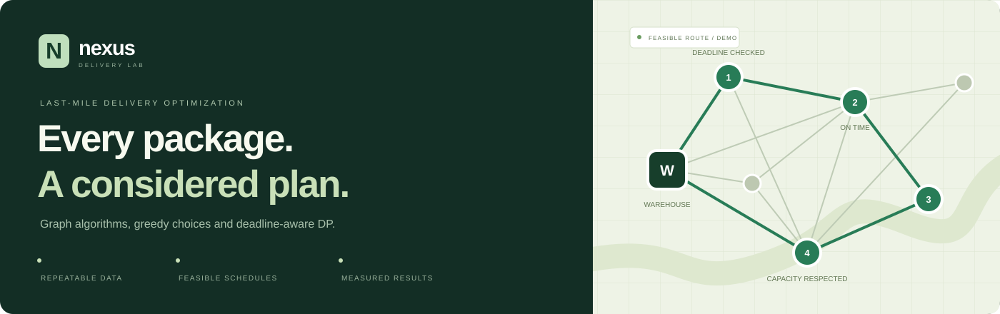
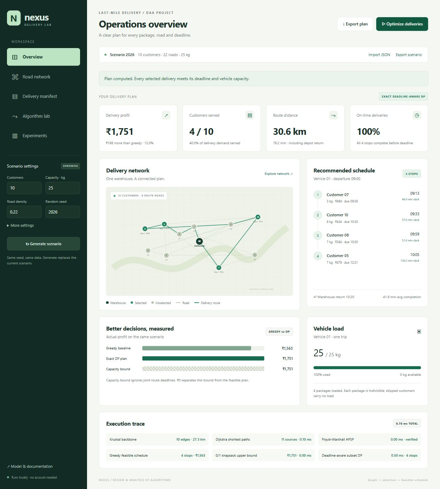
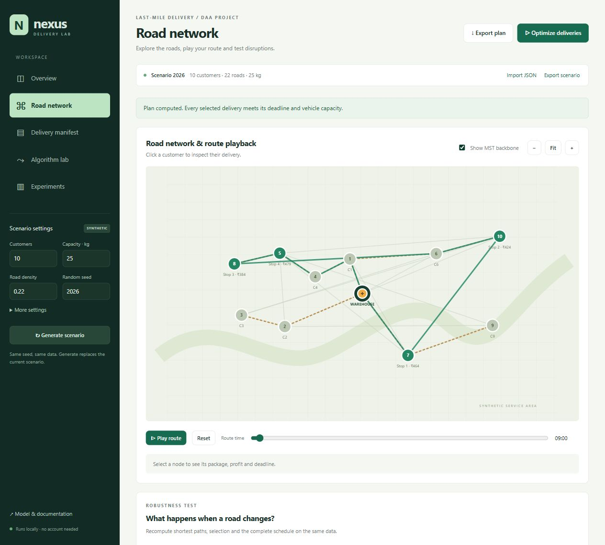
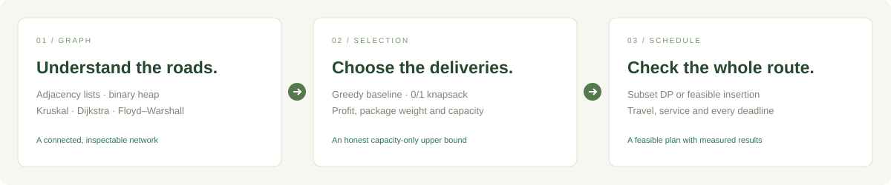
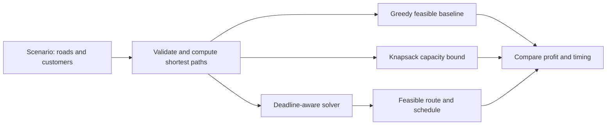

<p align="center">
  
</p>

<h1 align="center">Nexus Delivery</h1>
<p align="center"><strong>An inspectable plan for the last mile.</strong><br>Graph algorithms, capacity-aware selection, and deadline-aware scheduling in one interactive workspace.</p>

<p align="center">
  <a href="https://nexus-delivery-delta.vercel.app/"></a>
  
  
  
  
</p>
<p align="center">
  <a href="https://github.com/ChaithanReddyB21/nexus-delivery/actions/workflows/verify.yml"></a>
</p>
<p align="center">
  <a href="https://nexus-delivery-delta.vercel.app/">Live website</a> ·
  <a href="https://nexus-delivery-delta.vercel.app/dashboard.html">Open workspace</a> ·
  <a href="#run-locally">Run locally</a> ·
  <a href="docs/ALGORITHMS.md">Algorithms</a> ·
  <a href="docs/DEMO.md">Demo guide</a> ·
  <a href="#team">Team</a>
</p>

## Why Nexus?

A delivery plan must do more than pick profitable packages: it must fit the vehicle, follow open roads, and complete service before each customer's deadline. Nexus makes those decisions visible. Generate a reproducible scenario, compare a greedy baseline with a feasible solver, inspect the route, and see how a closure changes the plan.

Built as a **Design & Analysis of Algorithms project**, the website pairs a working simulator with explanations, repeatable experiments, and an independent Python implementation.

## Explore the workspace

| Area | What you can do |
| --- | --- |
| Operations overview | Inspect profit, capacity, customers served, route distance, deadlines, and the complete schedule. |
| Road network | Explore the graph, inspect customers, show the MST, zoom, and play the route along actual roads. |
| Delivery manifest | Edit packages, profits, deadlines, roads, and travel times; import or export a JSON scenario. |
| Algorithm lab | Read shortest paths, the Floyd–Warshall matrix, execution timing, and solver guarantees. |
| Experiments | Compare greedy and feasible plans across four scenarios, with three repeated runs and CSV export. |
| Disruption testing | Close a road or double its travel time and recompute the whole plan. |

### A look inside

Screenshots captured from the deployed website using the default seed **2026**.



<details>
<summary><strong>Explore the road network and MST overlay</strong></summary>



</details>

## Live website

**[Explore Nexus Delivery →](https://nexus-delivery-delta.vercel.app/)**  
**[Go directly to the delivery workspace →](https://nexus-delivery-delta.vercel.app/dashboard.html)**

Deployed on Vercel from this public repository. All computation runs in your browser. **No environment variables, SQL database, API keys, or backend service are required.** Scenario persistence uses your browser's local storage; it does not synchronize across devices.

For Vercel, use **Other** as the application preset, the repository root `./`, build command `npm run build`, and output directory `dist`. These settings are supplied in `vercel.json`.

## Run locally

Requires **Node.js 18 or newer** for the local server and tests. No npm dependencies need to be installed.

```bash
git clone https://github.com/ChaithanReddyB21/nexus-delivery.git
cd nexus-delivery
npm start
```

Open **http://127.0.0.1:4173** and keep the terminal running. On Windows, you can also double-click `start.cmd`. For a server-free demonstration, open `index.html` or `dashboard.html` directly in your browser.

### Python reference

Python 3.10 or newer; standard library only.

```bash
python python/delivery.py data/sample-scenario.json --output plan.json
```

The CLI consumes the same scenario format as the website. See the [dataset guide](docs/DATASET.md) for the schema and [reference results](data/sample-reference.json) for reproducible output.

## From roads to a feasible schedule





| Algorithm | Its role | What the result means |
| --- | --- | --- |
| Kruskal MST | Minimum-distance network backbone | Infrastructure illustration; the MST is not the delivery tour. |
| Dijkstra | Shortest travel paths on open roads | A binary min-heap supports path reconstruction. |
| Floyd–Warshall | All-pairs travel-time matrix | Cross-checks the shortest-path results. |
| Ratio greedy | Capacity- and deadline-feasible insertion baseline | Fast comparison, without an optimality guarantee. |
| 0/1 knapsack | Maximum profit under weight capacity alone | A profit upper bound that ignores joint route deadlines. |
| Subset dynamic programming | Exact deadline-aware solver for up to 12 customers | Maximizes feasible delivery profit for the implemented one-vehicle model. |
| Feasible insertion | Larger scenarios | Clearly marked heuristic; keeps at least the feasible greedy profit. |

The model uses **one warehouse, one vehicle, indivisible packages, positive road weights, and synthetic data**. Deadlines are checked at service completion, and the vehicle returns to the warehouse. See [algorithm details and complexity](docs/ALGORITHMS.md).

## Results you can reproduce

For the default scenario: **10 customers · seed 2026 · 25 kg capacity**.

| Metric | Result |
| --- | --- |
| Feasible delivery profit | **₹1,751** |
| Greedy profit | ₹1,563 |
| Improvement over greedy | **₹188 / 12.0%** |
| Selected customers, in order | 07 → 10 → 08 → 05 |
| Vehicle load | 25 / 25 kg |
| Route distance, including return | 30.6 km |
| Duration, including service and return | 79.2 minutes |
| Selected deliveries completed on time | 4 / 4 |

Measured experiment results, with three repeated runs per scenario:

| Customers | Capacity | Solver | Greedy profit | Feasible profit | Capacity bound |
| ---: | ---: | --- | ---: | ---: | ---: |
| 8 | 10 kg | Exact DP | ₹801 | **₹943** | ₹943 |
| 12 | 25 kg | Exact DP | ₹1,839 | **₹1,879** | ₹1,879 |
| 20 | 35 kg | Heuristic | ₹3,221 | **₹3,549** | ₹3,549 |
| 40 | 60 kg | Heuristic | ₹4,925 | **₹5,435** | ₹5,819 |

These are computed synthetic-scenario results, not real-world delivery performance claims. Runtime depends on the machine. See [measurement conditions and interpretation](docs/BENCHMARKS.md) and the [raw benchmark data](docs/benchmark-results.json).

## Verification

```bash
npm test
python -m unittest discover -s python -v
npm run build
```

The repository includes **11 JavaScript tests and 6 Python tests** covering algorithm correctness and feasibility. The GitHub Actions workflow runs both suites and the static build. Browser checks cover editing, imports, road disruptions, route playback, experiments, responsive layout, and export previews.

## Project structure

```text
nexus-delivery/
├── index.html              # Landing page
├── dashboard.html          # Interactive delivery workspace
├── app.js                  # UI, playback, editing and persistence
├── engine.js               # Graph algorithms and feasible route solvers
├── style.css               # Dashboard styles
├── landing.css             # Landing-page styles
├── server.cjs              # Local preview server
├── build.cjs               # Static distribution builder
├── vercel.json             # Deployment configuration
├── data/                   # Sample scenario and reference results
├── python/                 # Independent reference implementation and tests
├── tests/                  # JavaScript algorithm tests
├── docs/                   # Guides, benchmarks and original visual assets
└── .github/workflows/      # Automated verification
```

## Documentation

| Guide | Use it for |
| --- | --- |
| [Demo & viva guide](docs/DEMO.md) | A repeatable walkthrough and algorithm questions. |
| [Algorithms](docs/ALGORITHMS.md) | Formulation, implementation, guarantees, and complexity. |
| [Dataset format](docs/DATASET.md) | Importing, editing, validating, and exporting scenarios. |
| [Benchmarks](docs/BENCHMARKS.md) | Reproducing the measurements and understanding the bounds. |
| [Contributing](CONTRIBUTING.md) | Making focused, verifiable improvements. |

## Scope and future work

Nexus is a working educational simulator. It uses synthetic roads and packages, with browser-local persistence. Future extensions could add multiple vehicles, geographic routing, live traffic inputs, and shared scenario storage; those services are not part of this version.

## Team

Nexus Delivery is a **four-member group project**. All four members share credit for the project.

| Team member | Credit |
| --- | --- |
| **[Aryan Surapaneni](https://github.com/aryansurapaneni)** | Project team member |
| **[Anish Layam](https://github.com/anishlayam22)** | Project team member |
| **[B. Chaithan Reddy](https://github.com/ChaithanReddyB21)** | Project team member |
| **[A. Chetan Reddy](https://github.com/Chetan-404)** | Project team member |

Team names follow the submitted project report. Specific individual roles are not assigned here without confirmation; code contributions are recorded in the Git history. See [contributing](CONTRIBUTING.md) for the development workflow.

---

<p align="center">Built together by the Nexus Delivery team<br><sub>Design & Analysis of Algorithms · Group project</sub></p>
